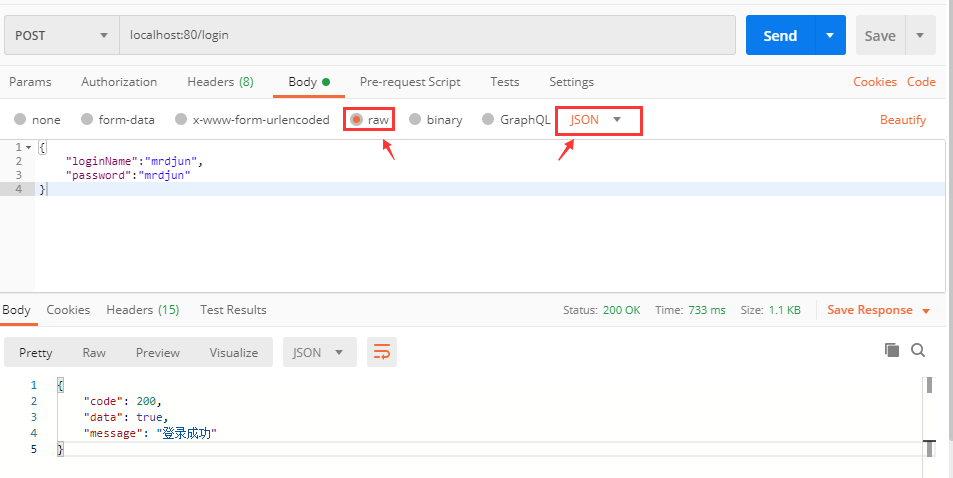
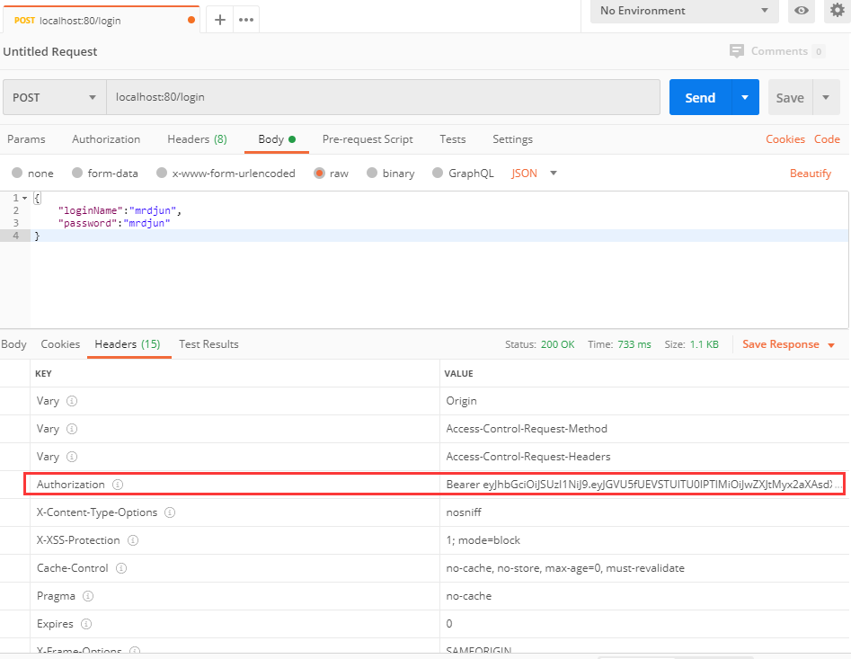
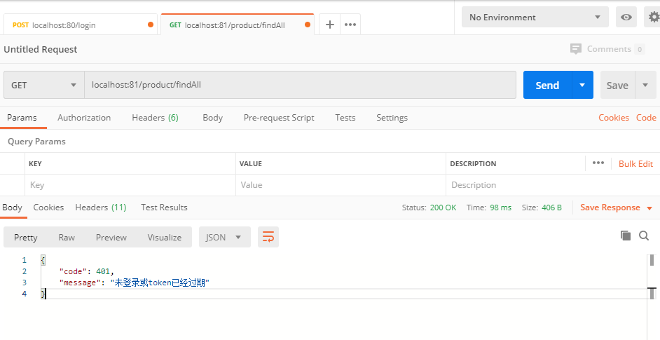

# fun-security
spring securiry + jwt +rsa 实现 sso 单点登录

## 项目介绍
1、这不仅仅是一个demo，如果你需要开发分布式中的认证模块，当前模块可以信手拈来，这也是我没有提取两个模块中的重复类的原因。

2、如果你是需要学习如何使用 spring security ，这也是一个非常不错的案例。

3、在项目中perms没有真正的起到作用（因为在后端判断权限使用role就已经足够了），但是我也做了这个perms，如果需要使用，直接开箱即用。

4、使用 rsa 会更加安全，但是会降低一点点的运行速度。

## 运行流程
1、先使用项目中提供的 RsaUtils 运行main函数生成一对rsa 秘钥；

2、调整数据库的ip、端口、账号、密码；

3、启动auth-server，通过postman的请求 localhost:80/login ，在postman中点击 Body、raw再选择JSON格式


默认账号在数据库中提供了两个：mrdjun、user账号和密码都是一样的，加密方式使用的是springsecurity默认的，好处在于数据库不用保存盐了。发送的 JSON 如下：
```json
{
	"loginName":"mrdjun",
	"password":"mrdjun"
}
```
4、登录成功后，在 header 中可以拿到 token ，复制出来；


5、启动client 端，在该端中只验证token是否有效和鉴权，而且是持公钥验证，公钥只保存在当前客户端不对外暴露；

6、将复制出来的 token 放在发送给客户端的请求中，字段使用Authorization；


7、你也可以验证这个 token 中到底有哪些权限，只需要在代码中使用JwtUtils工具类验证即可。

